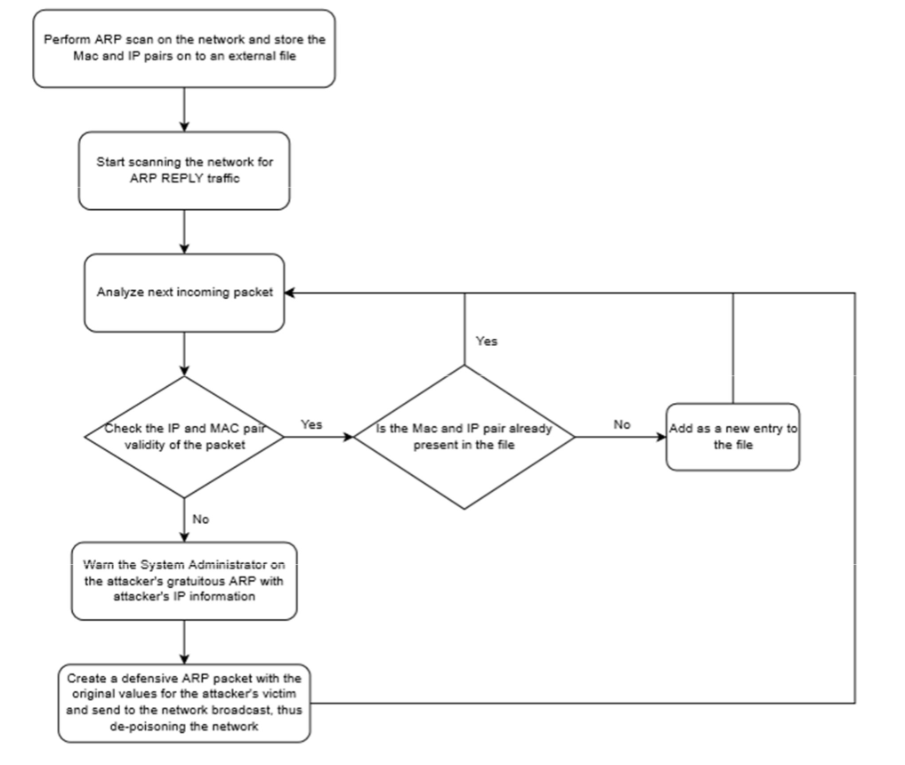

# Simple NIDS based on ARP traffic

Light weight NIDS to check on ARP Poisoning attacks and deploy gratuitous ARPs to actively depoison the network.

## System Requirements

1. Java SE 8 or higher
2. Pcap4J Core JAR Library
3. Pcap4J Packet Factory JAR Library
4. JNA (Java Native Access) JAR Library
5. Apache Commons Net JAR
6. Logback Classic and Core JAR Libraries
7. Slf4J logger JAR Library
8. WinPcap version 4.1.3 or higher
9. Windows Vista or higher

## Design

